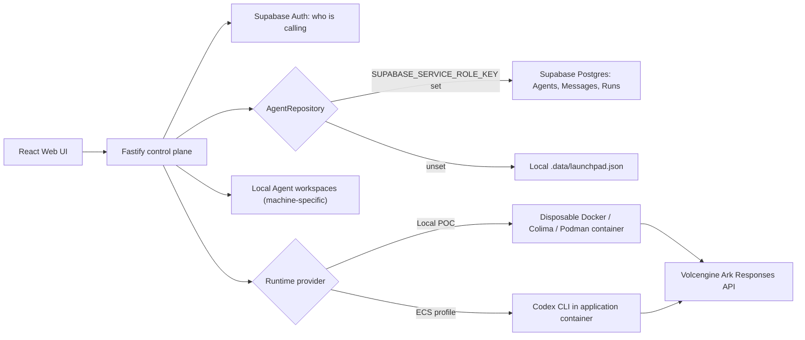

# Volc Agent Launchpad

A minimal Agent platform for three-day middleware hackathons. It provides Agent
CRUD, a browser Playground, persistent workspaces, and Codex CLI backed by the
Volcengine Ark Responses API.

Run it locally with Docker, Colima, or rootless Podman, or deploy it to
Volcengine ECS.

> [!WARNING]
> This is a hackathon proof of concept. It has per-user identity and Agent
> ownership (see [Authentication](#authentication-supabase) below) but still
> has no tracing, audit, or hardened sandbox middleware. Do not use production
> data or credentials. See [SECURITY.md](SECURITY.md).

## Screenshots

### Agent Playground


### Create an Agent


## Features

- React and TypeScript Web UI
- Agent create, edit, start, stop, delete, and multi-turn chat
- Fastify control plane with asynchronous Run state
- Persistent Agent workspaces and Codex sessions
- Disposable Docker, Colima, or Podman container for each local turn
- Docker and Terraform deployment paths for Volcengine ECS

## Requirements

- Node.js 22+
- npm 10+
- Docker, Colima, or Podman
- A Volcengine Ark API key and endpoint that supports the Responses API
- A Supabase project (free tier is fine) for sign-in — see
  [Authentication](#authentication-supabase)

Codex CLI is included in the Runtime image and is not required on the host.

## Local browser SOP

### 1. Check the local tools

Install Node.js 22+ and one supported container engine, then verify them:

```bash
node --version
npm --version
docker --version        # Docker Desktop, Docker Engine, or Colima
podman --version        # Use this instead when running Podman
```

Only one container engine is required. Codex CLI is already included in the
Runtime image.

### 2. Clone the repository

```bash
git clone <repository-url> volc-agent-launchpad
cd volc-agent-launchpad
```

Skip this step when already working from the repository root.

### 3. Configure environment

```bash
cp .env.example .env
```

Edit `.env` and fill in:

- `ARK_API_KEY` / `ARK_MODEL` — your own Ark credentials.
- `SUPABASE_URL` / `SUPABASE_ANON_KEY` / the matching `VITE_` copies — **your
  own** free Supabase project (create one at [supabase.com](https://supabase.com),
  values are under Settings > API). This is required — the app is gated
  behind sign-in, and every reviewer needs their own project for this, the
  same way everyone needs their own Ark key. See
  [Authentication](#authentication-supabase) for the two-minute setup.
- `SUPABASE_SERVICE_ROLE_KEY` — optional, leave blank. Only needed if you
  also want Agents/chat history to persist in Postgres instead of a local
  file; see [Data persistence](#data-persistence-supabase). Nothing below
  requires this.

### 4. Start the POC

```bash
npm run poc
```

The first run installs Node.js dependencies and builds the Runtime image. The
script automatically selects Docker, Colima, or Podman, and reads the
credentials from `.env`.

### 5. Open the browser

Visit <http://localhost:3000>, or open it from the terminal:

```bash
open http://localhost:3000       # macOS
xdg-open http://localhost:3000   # Linux desktop
```

In the Web UI:

1. Sign up with an email and password (the Supabase project from step 3).
2. Select **Create Agent**.
3. Enter a name, description, and workspace instructions.
4. Select **Create Agent** again.
5. Enter a task in the Playground, for example:

   ```text
   Create a TypeScript hello-world CLI, add a test, and run it.
   ```

The Agent can write files, run commands, and continue the same Codex session in
later messages.

### 6. Stop and resume

Press `Ctrl+C` in the startup terminal. The script removes temporary Runtime
containers but keeps Agent workspaces and conversations.

- macOS state: `~/.volc-agent-launchpad/`
- Linux state: `.local/`
- Custom location: set `LOCAL_POC_DATA_ROOT`

Run the same `npm run poc` command to continue later.

### Select a specific container engine

Force Podman when multiple engines are installed (credentials still come
from `.env`):

```bash
CONTAINER_ENGINE=podman npm run poc
```

Colima uses `CONTAINER_ENGINE=docker` because it exposes the Docker CLI.

For a clean Linux host, follow the
[rootless Podman setup](docs/LOCAL_POC.md#rootless-podman-on-linux).

## Docker Compose

Create and edit the configuration:

```bash
./scripts/bootstrap-local.sh
```

Required values in `.env`:

```dotenv
ARK_API_KEY=your-ark-api-key
ARK_MODEL=ep-your-endpoint-id
SUPABASE_URL=https://your-project-ref.supabase.co
SUPABASE_ANON_KEY=your-anon-key
VITE_SUPABASE_URL=https://your-project-ref.supabase.co
VITE_SUPABASE_ANON_KEY=your-anon-key
```

The `VITE_` pair must be set *before* the build — Vite bakes them into the
browser bundle at build time, so `docker compose up --build` reads them from
`.env` as build args, not as a running-container env var. Changing them
later needs a rebuild, not just a restart.

Start the application:

```bash
docker compose up --build
```

Open <http://localhost:3000>. Stop it without deleting Agent data:

```bash
docker compose down
```

## Development

```bash
npm install
cp .env.example .env
npm install --global @openai/codex@0.111.0
npm run dev
```

- Web UI: <http://localhost:5173>
- API: <http://localhost:3000>

Use local paths in `.env` when running outside Docker:

```dotenv
APP_DATA_DIR=.data
AGENT_WORKSPACE_ROOT=workspaces
CODEX_HOME=codex-home
```

## Authentication (Supabase)

Every `/api/agents*` and `/api/runs/*` request requires a signed-in Supabase
user, enforced in [`app.ts`](apps/server/src/app.ts) — not just hidden in the
UI. Each Agent has an `ownerId`; the service layer
([`agent-service.ts`](apps/server/src/agent-service.ts)) rejects any read or
write from a different account with a 404, including sending a prompt to
someone else's Agent. See [`agent-service.test.ts`](apps/server/src/agent-service.test.ts)
for the isolation tests.

1. Create a project at [supabase.com](https://supabase.com). Sign-in itself
   needs no schema — it uses Supabase's built-in `auth.users`. Skip to
   [Data persistence](#data-persistence-supabase) below if you also want
   Agents/Messages/Runs to follow the account across machines.
2. Copy **Settings > API > Project URL** and **anon public key** into `.env`:

   ```dotenv
   SUPABASE_URL=https://your-project-ref.supabase.co
   SUPABASE_ANON_KEY=your-anon-key
   VITE_SUPABASE_URL=https://your-project-ref.supabase.co
   VITE_SUPABASE_ANON_KEY=your-anon-key
   ```

   The `SUPABASE_*` pair is read by the server to verify sessions. The
   `VITE_`-prefixed copies are the same values, exposed to the browser build
   (Vite only bundles `VITE_`-prefixed variables). The anon key is Supabase's
   public client key, safe to ship in the browser — never put the
   `service_role` key here.
3. Email/password sign-up works immediately. Supabase requires confirming the
   email by default — for frictionless demos, turn that off under
   **Authentication > Providers > Email > Confirm email**.

Google sign-in is intentionally left out for now; email/password is the only
method the login screen offers.

### Data persistence (Supabase)

By default, Agents/Messages/Runs live in `.data/launchpad.json` on whatever
machine created them — sign-in follows the account everywhere, but the data
doesn't. Configuring this makes it: any machine, signed into the same
account, sees the same Agents and full chat history.

**What does and doesn't follow the account.** Agent config, status, and
every message/run are stored in Postgres and sync everywhere. The actual
files Codex writes, and Codex's own session state, are still written to disk
on whatever machine ran that turn (`.local/workspaces/<id>/`,
`.local/codex-home/`) — those were never portable and still aren't. Opening
an Agent on a machine that's never run it before shows the full past
conversation, but the next message starts a **new** Codex session in a
freshly-provisioned empty workspace (handled automatically in
[`agent-service.ts`](apps/server/src/agent-service.ts) — it can't resume a
session it never had).

1. In the Supabase SQL Editor, run
   [`docs/supabase-agents-schema.sql`](docs/supabase-agents-schema.sql) once
   (idempotent — safe to re-run).
2. Copy **Settings > API > service_role secret** (not the anon key) into
   `.env` only:

   ```dotenv
   SUPABASE_SERVICE_ROLE_KEY=your-service-role-key
   ```

   Never add a `VITE_` copy of this — the service_role key bypasses all
   access control and must never reach the browser. Ownership is enforced
   in application code ([`supabase-repository.ts`](apps/server/src/supabase-repository.ts)),
   with Row Level Security policies on the tables as defense-in-depth.
3. Restart the server. Leave `SUPABASE_SERVICE_ROLE_KEY` unset to keep using
   the local JSON file — nothing else changes.

## Deployment

> [!NOTE]
> The ECS/Terraform docs below still mention `APP_AUTH_TOKEN`, a shared
> demo-password gate that predates per-user auth. The app no longer reads
> that variable — Supabase sign-in is the only access control now — so it's
> safe to leave out of `.env` for these paths too. That documentation hasn't
> been updated yet since the cloud deployment path is optional and untested
> in this change.

- [Existing Linux ECS with Docker](docs/DEPLOYMENT.md#existing-linux-ecs)
- [Complete Volcengine environment with Terraform](docs/DEPLOYMENT.md#terraform-deployment)
- [Local Docker, Colima, and Podman details](docs/LOCAL_POC.md)

The existing-ECS script deploys from the current source tree:

```bash
cp .env.example .env.production
./scripts/deploy-existing-ecs.sh .env.production
```

The Terraform path provisions VPC, subnet, security group, ECS, and EIP:

```bash
cp deploy/volcengine/terraform.tfvars.example \
  deploy/volcengine/terraform.tfvars
./scripts/deploy-volcengine.sh
```

## Configuration

| Variable | Default | Purpose |
| --- | --- | --- |
| `ARK_API_KEY` | Required | Ark model API key. |
| `ARK_MODEL` | Required | Responses-capable endpoint or model ID. |
| `ARK_BASE_URL` | Beijing v3 endpoint | Ark OpenAI-compatible API URL. |
| `SUPABASE_URL` / `SUPABASE_ANON_KEY` | Required | Verifies who is signed in; see [Authentication](#authentication-supabase). |
| `SUPABASE_SERVICE_ROLE_KEY` | Empty (local JSON file) | Persists Agents/Messages/Runs in Postgres; see [Data persistence](#data-persistence-supabase). |
| `RUNTIME_PROVIDER` | `local-process` | `container` for disposable local Runtime containers. |
| `CODEX_SANDBOX_MODE` | `workspace-write` | Codex inner sandbox mode. |
| `CODEX_TIMEOUT_MS` | `600000` | Maximum duration of one turn. |
| `LOCAL_POC_DATA_ROOT` | Platform-specific | Local metadata, workspace, and session directory. |

See [.env.example](.env.example) for all Runtime and resource-limit options.

## How it works



The first turn uses `codex exec`; later turns resume the stored Codex thread.
Deleting an Agent archives its workspace under `workspaces/.deleted/`.

See [docs/ARCHITECTURE.md](docs/ARCHITECTURE.md) for component and extension
boundaries.

## Validation

```bash
npm run check
terraform fmt -check -recursive deploy/volcengine
docker compose config
```

## Documentation

- [Architecture](docs/ARCHITECTURE.md)
- [Local POC](docs/LOCAL_POC.md)
- [Deployment](docs/DEPLOYMENT.md)
- [Hackathon extension guide](docs/HACKATHON_EXTENSION_GUIDE.md)
- [Security policy](SECURITY.md)
- [Contributing](CONTRIBUTING.md)

## License

[MIT](LICENSE)
