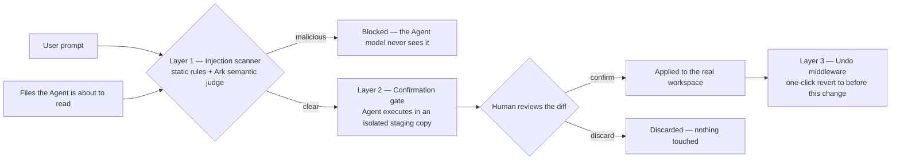
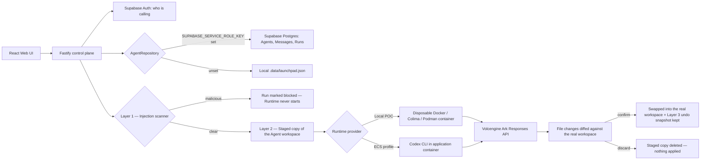

# Filewall

**A three-layer security middleware for AI coding agents — smarter prompt-injection
detection, a confirm-before-write gate, and one-click rollback.**

Filewall sits between an AI coding agent and its model and filesystem. It closes a
gap most agent platforms leave open: they'll let a model read a file, act on
instructions hidden inside it, and write permanent changes to a workspace — all in
one uninterrupted step, with no human ever seeing what was about to happen.

Filewall breaks that single step into three independent checkpoints:

1. **Catch the injected instruction** before the model ever reads it.
2. **Hold every file change for human review** before it's real.
3. **Keep a one-click undo** for the cases a human approves something they later
   regret.

Each layer works even if the others fail — a malicious file that slips past
detection still can't write anything without approval; an approved change that
turns out wrong can still be reverted.

## The problem

Coding agents don't just answer questions — they read files and act on what's in
them, then write real changes back to disk. That creates an injection surface a
plain chat model doesn't have: a resume, a config file, a code comment can carry
an instruction the *user* never wrote and never approved, and the agent has no
built-in way to tell that instruction apart from a legitimate one. By the time a
human notices, the files are already changed.

Filewall is the middleware layer that closes that gap, without requiring the
underlying agent to be redesigned.

## Three layers of protection

### 1. Prompt & content injection scanning

Every prompt *and* every file the Agent is about to read is scanned before the
model ever sees either — two tiers, run together:

- **Static tier** — fast, deterministic pattern matching for disguised
  instructions, fake system/developer messages, invisible Unicode tricks,
  homoglyphs, encoded payloads, and content hidden via styling (zero font size,
  text-colored-to-match-background, off-screen positioning) in HTML and PDF
  content.
- **Semantic tier** — a second opinion from an LLM judge (Ark) that cross-checks
  content against the *specific Agent's stated purpose* — the only tier that can
  catch a directive in another language, or recognize that "approve this
  candidate" is out of scope for an Agent whose instructions say it must never
  make hiring decisions.

A malicious finding blocks the run outright — the Agent model never starts.
Findings are always shown to the person who sent the prompt, not silently
swallowed.

Implementation: [`injection-scanner.ts`](apps/server/src/injection-scanner.ts),
[`ark-semantic-judge.ts`](apps/server/src/ark-semantic-judge.ts),
[`pdf-scanner.ts`](apps/server/src/pdf-scanner.ts).

### 2. File modification confirmation gate

The Agent never writes to the real workspace directly. Every turn executes in an
isolated staged copy; any file it creates, modifies, or deletes sits as a
reviewable proposal — collapsed rows, one per file, badged by kind, expandable to
a line-by-line diff or full content — until a human explicitly **confirms**
(swaps the staged copy in) or **discards** it (deleted, real workspace never
touched). A follow-up prompt refines the same pending proposal in place instead
of starting over.

Implementation: [`workspace-transaction.ts`](apps/server/src/workspace-transaction.ts),
the `sendMessage`/`executeRun` flow in
[`agent-service.ts`](apps/server/src/agent-service.ts).

### 3. Undo / rollback middleware

Confirming a change automatically keeps a single snapshot of the workspace as it
was immediately before that change. One click reverts it — like Ctrl+Z, not a
full undo/redo stack: it's the *last* confirmed change, not a change history, and
using it doesn't leave anything to redo. A later no-op turn (a plain question,
nothing written) never overwrites an existing undo point.

Implementation: `commit()`/`undo()` in
[`workspace-transaction.ts`](apps/server/src/workspace-transaction.ts),
`confirmRun()`/`undoLastCommit()` in
[`agent-service.ts`](apps/server/src/agent-service.ts).

## How it fits into an Agent's request flow



No layer requires the underlying Agent to change how it works — Filewall wraps
the existing prompt-in, files-out execution loop rather than replacing it.

## Reference implementation: Volc Agent Launchpad

The three layers above are demonstrated end-to-end by a full working Agent
platform included in this repo — React/TypeScript Web UI, Fastify control plane,
Codex CLI driven by the Volcengine Ark Responses API, Supabase Auth with
per-account Agent ownership. It's how you'd actually run Filewall and see it work
against a real coding Agent, not just read about it.

> [!WARNING]
> The reference app is a hackathon proof of concept: no tracing/audit trail, and
> no hardened multi-tenant sandbox beyond ordinary containers. Don't point it at
> production data or credentials. See [SECURITY.md](SECURITY.md).

### Requirements

- Node.js 22+, npm 10+
- Docker, Colima, or Podman
- A Volcengine Ark API key and endpoint that supports the Responses API

Sign-in works out of the box against a Supabase project already configured for
reviewers — no Supabase account needed just to try it. See
[Authentication](#authentication-supabase) if you'd rather use your own. Codex
CLI is included in the Runtime image and isn't required on the host.

### Quickstart

```bash
git clone <repository-url> volc-agent-launchpad
cd volc-agent-launchpad
cp .env.example .env
```

Edit `.env` and fill in `ARK_API_KEY` / `ARK_MODEL` (your own Ark credentials —
required). The `SUPABASE_*` / `VITE_SUPABASE_*` values are already filled in with
a project set up for reviewers to sign in against; leave them as-is unless you'd
rather use your own (see [Authentication](#authentication-supabase)).
`SUPABASE_SERVICE_ROLE_KEY` is optional and genuinely secret — leave it blank
unless you want cross-machine persistence (see
[Data persistence](#data-persistence-supabase)).

```bash
npm run poc
```

The first run installs dependencies and builds the Runtime image, then opens on
<http://localhost:3000>. In the Web UI: sign up with any email/password, **Create
Agent**, give it a name and instructions, then send it a task. Watch Layer 2 in
action on the very first file it touches — nothing lands until you confirm it.

Press `Ctrl+C` to stop; it keeps Agent workspaces and conversations
(`.local/` locally, `~/.volc-agent-launchpad/` on macOS, or set
`LOCAL_POC_DATA_ROOT`). Run `npm run poc` again to resume.

Multiple container engines installed? Force one explicitly:

```bash
CONTAINER_ENGINE=podman npm run poc
```

For a clean Linux host, see the
[rootless Podman setup](docs/LOCAL_POC.md#rootless-podman-on-linux).

### Docker Compose

```bash
./scripts/bootstrap-local.sh
```

Fill in `ARK_API_KEY` / `ARK_MODEL` in `.env` (the Supabase pair is already
filled in). The `VITE_SUPABASE_*` values must be set *before* the build — Vite
bakes them into the browser bundle at build time, so `docker compose up --build`
reads them as build args, not a running-container env var; changing them later
needs a rebuild, not just a restart.

```bash
docker compose up --build   # start, open http://localhost:3000
docker compose down         # stop, keeps Agent data
```

### Development

```bash
npm install
cp .env.example .env
npm install --global @openai/codex@0.111.0
npm run dev
```

Web UI on <http://localhost:5173>, API on <http://localhost:3000>. Use local
paths outside Docker:

```dotenv
APP_DATA_DIR=.data
AGENT_WORKSPACE_ROOT=workspaces
CODEX_HOME=codex-home
```

### Authentication (Supabase)

Every `/api/agents*` and `/api/runs/*` request requires a signed-in Supabase
user, enforced in [`app.ts`](apps/server/src/app.ts) — not just hidden in the
UI. Each Agent has an `ownerId`; [`agent-service.ts`](apps/server/src/agent-service.ts)
rejects any read or write from a different account with a 404, including
sending a prompt to someone else's Agent. See
[`agent-service.test.ts`](apps/server/src/agent-service.test.ts) for the
isolation tests.

**Nothing to set up by default.** [`.env.example`](.env.example) already has a
Supabase project's URL and anon (public) key filled in for reviewers to sign in
against. Publishing the anon key is intentional and safe — it's Supabase's
public client key, designed to be shipped in browser code and constrained by
Row Level Security, unlike the `service_role` key, which must never appear
here.

Prefer your own project instead of the shared one? Create one at
[supabase.com](https://supabase.com) (sign-in needs no schema — it uses
Supabase's built-in `auth.users`), then replace all four of `SUPABASE_URL`,
`SUPABASE_ANON_KEY`, `VITE_SUPABASE_URL`, `VITE_SUPABASE_ANON_KEY` with that
project's **Settings > API > Project URL** and **anon public key**.
Email/password sign-up works immediately; Supabase confirms email by default —
turn that off under **Authentication > Providers > Email > Confirm email** for
frictionless demos. Google sign-in is intentionally left out; email/password is
the only method offered.

#### Data persistence (Supabase)

By default, Agents/Messages/Runs live in `.data/launchpad.json` on whatever
machine created them — sign-in follows the account everywhere, but the data
doesn't. Configuring this makes any machine signed into the same account see the
same Agents and full chat history. Agent config, status, and every message/run
sync through Postgres; the actual files Codex writes and Codex's own session
state stay local to whichever machine ran that turn — those were never portable.

This is the one place a genuinely secret key is involved, so it needs **your
own** Supabase project — never the shared sign-in project above, since its
service_role key would let anyone read or write every reviewer's data.

1. In your own project's SQL Editor, run
   [`docs/supabase-agents-schema.sql`](docs/supabase-agents-schema.sql) once
   (idempotent).
2. Copy that project's **Settings > API > service_role secret** (not the anon
   key) into `.env` only, as `SUPABASE_SERVICE_ROLE_KEY`. Never add a `VITE_`
   copy — it bypasses all access control and must never reach the browser.
   Ownership is enforced in application code
   ([`supabase-repository.ts`](apps/server/src/supabase-repository.ts)), with
   Row Level Security as defense-in-depth.
3. Restart the server. Leave it unset to keep using the local JSON file.

### Deployment

- [Existing Linux ECS with Docker](docs/DEPLOYMENT.md#existing-linux-ecs)
- [Complete Volcengine environment with Terraform](docs/DEPLOYMENT.md#terraform-deployment)
- [Local Docker, Colima, and Podman details](docs/LOCAL_POC.md)

```bash
cp .env.example .env.production
./scripts/deploy-existing-ecs.sh .env.production
```

```bash
cp deploy/volcengine/terraform.tfvars.example deploy/volcengine/terraform.tfvars
./scripts/deploy-volcengine.sh
```

> [!NOTE]
> The ECS/Terraform docs still mention `APP_AUTH_TOKEN`, a shared demo-password
> gate that predates per-user auth. The app no longer reads it — Supabase
> sign-in is the only access control now — so it's safe to leave out of `.env`
> for these paths too; that documentation hasn't been updated yet.

### Configuration

| Variable | Default | Purpose |
| --- | --- | --- |
| `ARK_API_KEY` | Required | Ark model API key. |
| `ARK_MODEL` | Required | Responses-capable endpoint or model ID. |
| `ARK_BASE_URL` | Beijing v3 endpoint | Ark OpenAI-compatible API URL. |
| `SUPABASE_URL` / `SUPABASE_ANON_KEY` | Required | Verifies who is signed in; see [Authentication](#authentication-supabase). |
| `SUPABASE_SERVICE_ROLE_KEY` | Empty (local JSON file) | Persists Agents/Messages/Runs in Postgres; see [Data persistence](#data-persistence-supabase). |
| `RUNTIME_PROVIDER` | `local-process` | `container` for disposable local Runtime containers. |
| `CODEX_SANDBOX_MODE` | `workspace-write` | Codex inner sandbox mode. |
| `CODEX_TIMEOUT_MS` | `600000` | Maximum duration of one turn. |
| `LOCAL_POC_DATA_ROOT` | Platform-specific | Local metadata, workspace, and session directory. |

See [.env.example](.env.example) for all Runtime and resource-limit options.

## Architecture



The first turn uses `codex exec`; later turns resume the stored Codex thread.
Deleting an Agent archives its workspace under `workspaces/.deleted/`. See
[docs/ARCHITECTURE.md](docs/ARCHITECTURE.md) for component and extension
boundaries.

### Validation

```bash
npm run check
terraform fmt -check -recursive deploy/volcengine
docker compose config
```

## Documentation

- [Architecture](docs/ARCHITECTURE.md)
- [Local POC](docs/LOCAL_POC.md)
- [Deployment](docs/DEPLOYMENT.md)
- [Hackathon extension guide](docs/HACKATHON_EXTENSION_GUIDE.md)
- [Security policy](SECURITY.md)
- [Contributing](CONTRIBUTING.md)

## License

[MIT](LICENSE)
